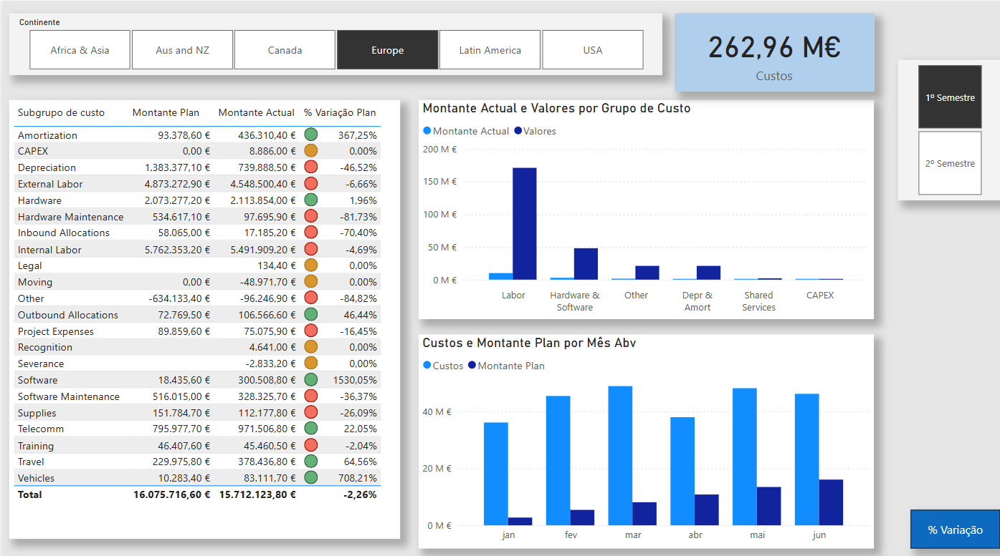

# 💼 Custo TI - Power BI Report

This project presents an interactive analysis of IT Costs using Power BI, based on Excel data. It explores budgeted versus actual values across time, business areas, and regions — with filters and dynamic visuals that support better decision-making.

## 🛠️ Tools & Skills
- Power BI (Desktop and Mobile layout)
- Excel as data source
- Power Query for data transformation
- DAX for KPIs and calculations
- Data visualization and interactivity

## 📌 Project Highlights

🔍 **Main insights:**
- % Variation between actual and planned costs, analyzed by **month**, **business area**, and **country**
- Filters available for **IT Area** and **Subarea**
- Total costs by **continent** with dynamic filtering
- Conditional formatting for budget variance using a **color-coded indicator**
- Key visuals:
  - Card for **Total Costs**
  - Table with **Subgroup**, **Planned Cost**, **Actual Cost**, and **% Variation**
  - Bar chart: **Planned vs Actual Costs per Month**

✅ Available in both **desktop** and **mobile** layouts.

## 📷 Preview

## 📁 Files

- `Custo TI (online_completo).pbix`: Power BI report file
- Data Source: Excel file (not included)

---

Let me know your thoughts and share ideas 🚀
